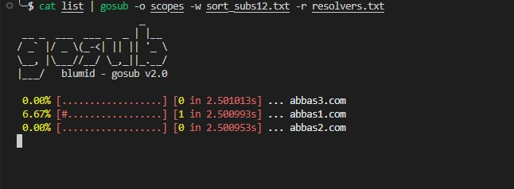
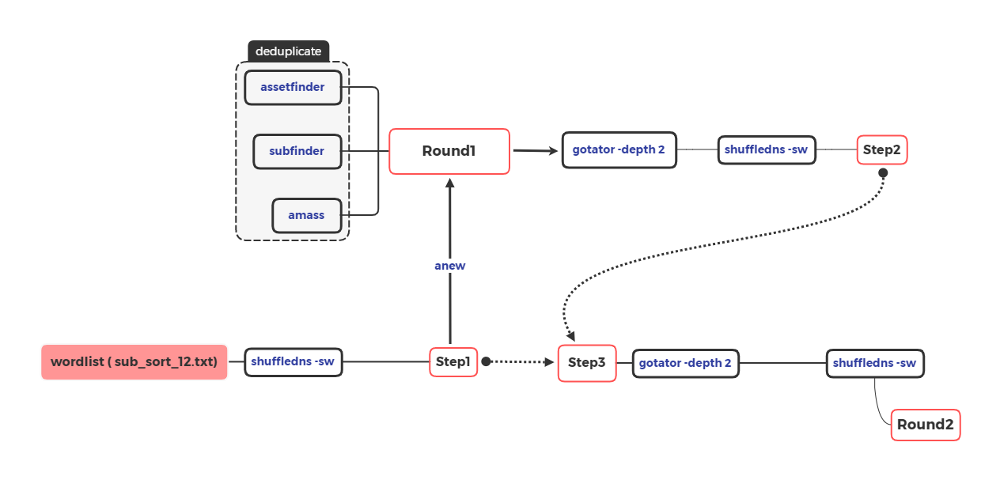

# gosub

Accept line-delimited wild domains on stdin and execute some tools on them and store output in a directory which you determined using **-o** flag.

<h1 align="center">
  </a>
</h1>

# Usage

```bash
cat list | gosub -w wordlist.txt -r resolver.txt -o scopes
```

# Install

```bash
go install github.com/blumid/gosub@latest
```

<br>

```yaml
Flags:
   -l string  list wildcard domains resolve (file or stdin)
   -o string  output folder (default "scopes")
   -w string  wordlist file (default "~/BugBounty/wordlist/sort_subs12.txt")
   -r string  resolver file (default "~/BugBounty/wordlist/resolvers.txt")
   -c int     maximum number of concurency processes - max:5 (default 3)
   -s         silent mode - no banner

```


**Notice:** you have to install below tools before run this tool
Requirement tools:
* amass
* subfinder
* assetfinder
* dnsx
* gotator
* anew
* shuffledns


# Map
<h1 align="center">
  </a>
</h1>